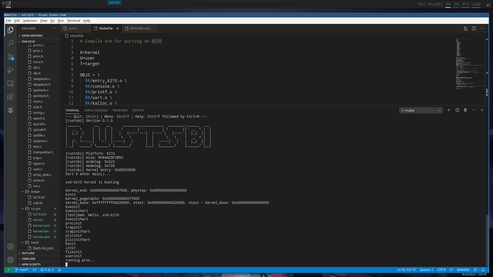

# XV6-RISCV On K210
Run xv6-riscv on k210 board
  

## Dependencies
+ k210 board
+ RISC-V Toolchain

## Installation
>\$ git clone https://github.com/SKTT1Ryze/xv6-k210

## Build
First you need to connect your k210 board to your PC.  
And check the USB port:  
>\$ ls /dev/ | grep USB  

In my situation it will be `ttyUSB1`  

>\$ cd xv6-k210  
>\$ mkdir target  
>\$ make build

## Run
>\$ make run-k210 k210-serialport=`Your-USB-port`(default by ttyUSB1)  

Ps: Most of the k210-port in Linux is ttyUSB0, if you use Windows or Mac OS, this doc 
may help you: [maixpy-doc](https://maixpy.sipeed.com/zh/get_started/env_install_driver.html#)  

## What I have done
+ Multicore boot
+ Implement bare-metal printf
+ Memory alloc
+ Page Table
+ Timer interrupt
+ S mode extern interrupt
+ receive uarths message

## What I'm doing
Try to read sdcard data on k210.  

## TODO
The rest part of xv6-kernel and xv6-fs

## LICENSE
MIT License
